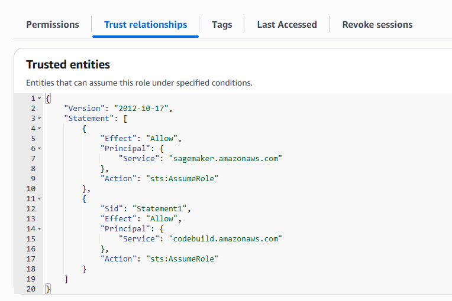
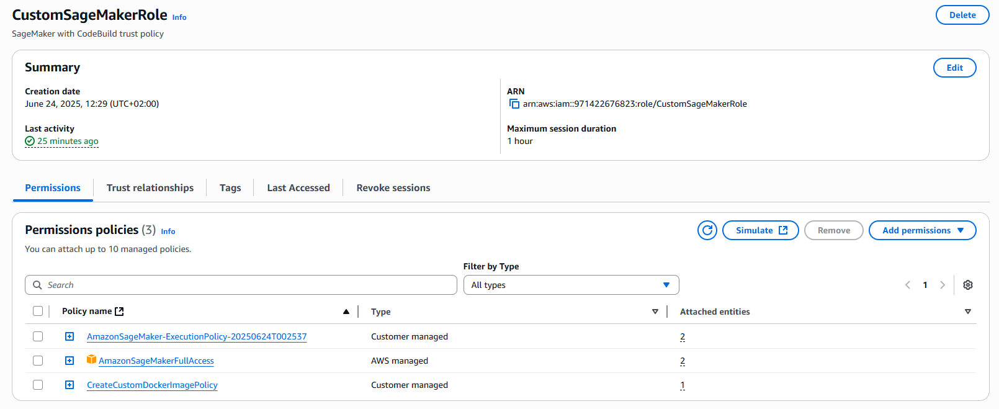
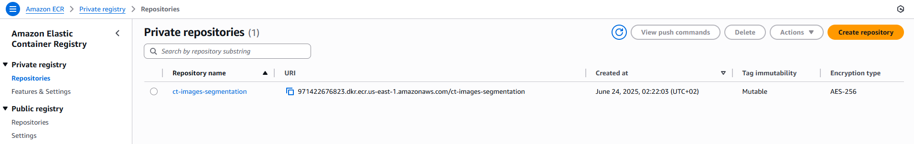

# Creating a custom docker image in SageMaker Studio

For this project I need a custom Docker container, 
which has installed more libraries than in AWS-managed `pytorch-training`. 
I use the `pytorch-training` as the base image and install packages from [requirements.txt](requirements.txt).

I can build and push the image from SageMaker Studio, however, it requires attaching correct policies.
I will create a custom Execution role, which I will attach to my SageMaker Studio domain and user 

## Create the Trust Policy

The new custom execution role must have a trust policy which allows
both CodeBuild service and SageMaker to assume a role. 
Here is the [trust_policy.json](../infrastructure/iam/trust_policy.json).



## Attach permissions

The role needs a SageMaker Execution policy ([sagemaker_execution_policy.json](../infrastructure/iam/sagemaker_execution_policy.json))
and a CodeBuild Execution policy ([run_code_build_execution_policy.json](../infrastructure/iam/run_code_build_execution_policy.json)).
It also needs `AmazonSageMakerFullAccess`. Here is how my permissions look like:



## Build and push the Docker image

I could use `docker` commands directly in the SageMaker Studio terminal, 
however SageMaker provides some utility scripts which facilities pushing the container to ECR.
You need to `pip install` it first, and the run `sm-docer build` command. The command below pushes the container
to my repository called `ct-images-segmentation`:

```shell
# Assuming you are in ./docker folder
$ pip install sagemaker-studio-image-build
$ sm-docker build . --repository ct-images-segmentation:latest
```


